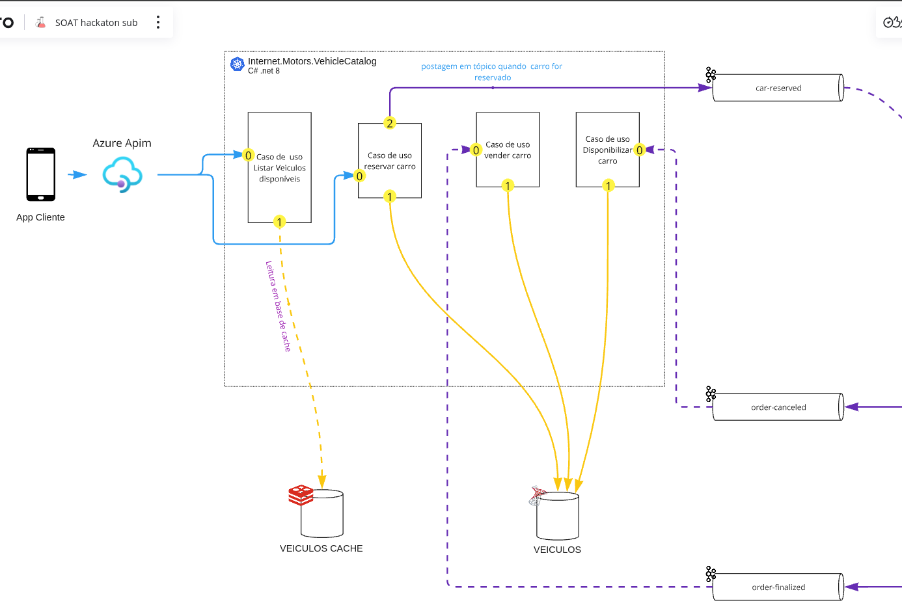
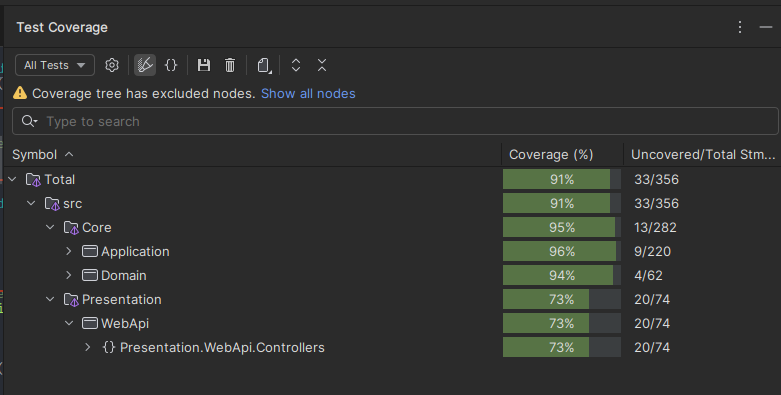

# Vehicle Catalog Service

Esse projeto consiste na gestão de Veículos à venda, são duas aplicações, a primeira é WebApi e a segunda é a Consumers



---

## Pré-requisitos

Antes de executar o projeto, é importante garantir que os seguintes pré-requisitos estejam instalados e configurados:

1. **.NET 8.0 SDK**:
    - Certifique-se de ter o SDK do .NET 8.0 instalado em sua máquina.
    - [Download .NET SDK](https://dotnet.microsoft.com/download/dotnet).

2. **Docker**:
    - Necessário para configurar o broker Kafka (se não estiver disponível localmente).
    - [Download Docker](https://www.docker.com/products/docker-desktop).

5. **Ferramentas de Desenvolvimento**:
    - Qualquer IDE compatível com .NET, como:
        - JetBrains Rider (Recomendado).
        - Visual Studio.
        - Visual Studio Code (com extensão C#).

--- 

### WebApi

A WebApi do projeto é responsável por lidar com os comandos relacionados aos veículos, permitindo a execução de ações
como o registro, consulta, atualização e remoção de veículos à venda. Ela expõe endpoints RESTful que podem ser
consumidos por aplicações externas ou ferramentas como Postman.

#### Principais Funcionalidades

- **Registro de Veículos**: Permite adicionar novos veículos ao catálogo.
- **Atualização e Exclusão**: Suporte para a edição ou remoção de veículos já cadastrados.
- **Consulta de Veículos**: Fornece endpoints para buscar veículos com base em diferentes critérios, como ID, tipo ou
  status.
- **Swagger para Documentação**: Interface interativa disponível para testar e visualizar os endpoints.

### Consumers

A aplicação `Consumers` é uma aplicação de backend responsável por processar mensagens provenientes de um broker Kafka.
Ela faz isso ouvindo eventos que são publicados em tópicos específicos no Kafka e realizando ações baseadas nessas
mensagens.

#### Principais Funcionalidades

- **Processamento Assíncrono com Kafka**:
   - Escuta o tópico `order-canceled` e `order-finalized` no Kafka para captar eventos relacionados a ordens canceladas e finalizadas.
   - Realiza o processamento das mensagens capturadas e executa comandos correspondentes, como liberação do veículo em estoque ou atualização de
     status de veículos para vendido.

- **MediatR para CQRS**:
   - Utiliza o padrão CQRS para separar responsabilidades de leitura e escrita, garantindo um design mais escalável.
   - MediatR atua como mediador para chamar os respectivos handlers de comandos.

- **Consumidor Baseado em Scoped Dependency Injection**:
   - Implementa um consumidor Kafka utilizando o `IServiceProvider` para gerenciamento de escopo, facilitando a injeção
     de dependências necessárias para o processamento das mensagens.

#### Fluxo de Execução

1. A aplicação inicia o consumidor Kafka e se conecta ao broker configurado.
2. Para cada mensagem recebida do `order-canceled` e `order-finalized`, a aplicação invoca os handlers correspondentes através de MediatR.
3. Após o processamento, a aplicação registra o sucesso ou reporta falhas no log.

#### Configuração do Consumidor

Os detalhes sobre o consumidor estão especificados no arquivo `appsettings.json`, como o servidor Kafka, o grupo de
consumidores e a política de leitura de offset. Exemplo:

```json
{
  "ConsumerConfig": {
    "BootstrapServers": "localhost:9092",
    "GroupId": "vehicle-catalog-consumer-group",
    "AutoOffsetReset": "Earliest"
  }
}
```

#### Requisitos para Executar a Aplicação

- Kafka deve estar configurado e rodando na máquina local ou em um ambiente remoto.
- O tópico `order-canceled` e `order-finalized` precisa existir no Kafka.
- Certifique-se de que o endereço do servidor Kafka está configurado corretamente no `appsettings.json`.

Com esta arquitetura, a aplicação `Consumers` garante um processamento eficiente de eventos relacionados a cancelamentos
de ordens, integrando mensagens do Kafka ao domínio do catálogo de veículos.

# Estrutura do Projeto

O projeto segue uma arquitetura baseada em Clean Architecture, separação de responsabilidades, com os seguintes módulos principais:

---

## 1. Core.Domain

O módulo `Core.Domain` é responsável pelo núcleo do domínio da aplicação e contém:

- **Entidades**: Representam os objetos reais do domínio (como `Vehicle`).
- **Agregados e Value Objects**: Implementação de conceitos DDD.
- **Interfaces de Repositórios**: Contratos que definem como interagir com o armazenamento persistente.
- **Serviços de Domínio**: Contêm lógica específica do domínio que não se encaixa diretamente em uma entidade ou agregado.

Este módulo possui **dependência mínima** de outros projetos, permitindo maior autonomia do domínio.

---

## 2. Core.Application

O módulo `Core.Application` implementa a lógica de aplicação e regras de negócio utilizando o padrão CQRS. Ele contém:

- **Comandos e Handlers**:
    - Gerenciam operações que modificam o estado do sistema, como criação, edição e exclusão de veículos.
- **Consultas e Handlers**:
    - Manipulam requisições de leitura de dados, oferecendo resultados baseados nos critérios fornecidos.
- **Serviços de Integração**:
    - Interfaces para ferramentas externas (e.g., serviços de mensageria).

O `Core.Application` utiliza a biblioteca **MediatR** para desacoplar os handlers de comandos/consultas das implementações.

---

## 3. Infrastructure.Data

O módulo `Infrastructure.Data` cuida da implementação de acesso ao banco de dados e persistência. Contém:

- **Implementações de Repositório**:
    - Fornecem conectores para o banco de dados SQL por meio de **Entity Framework Core**.
- **Configurações de Mapeamento**:
    - Todas as entidades do domínio são configuradas utilizando Fluent API.
- **Migrations**:
    - Gerencia a criação e manutenção do schema do banco de dados.

Este módulo é a camada que comunica diretamente com o SQL Server para persistir e consultar os dados.

---

## 4. Infrastructure.Messaging

O módulo `Infrastructure.Messaging` gerencia toda a integração com serviços de mensageria (como Kafka). Ele inclui:

- **Produtores**:
    - Publicam mensagens nos tópicos configurados no broker Kafka.
- **Consumidores**:
    - Escutam mensagens em tópicos específicos e as encaminham para os handlers apropriados no domínio.
- **Configurações**:
    - Configura o cliente Kafka e defines estratégias de escuta/publicação.

Essa camada serve como ponto de conexão entre a aplicação e o broker Kafka.

---

## 5. Presentation.WebApi

O módulo `Presentation.WebApi` é a camada responsável por expor as funcionalidades do sistema por meio de uma API RESTful. Contém:

- **Controllers**:
    - Implementam os endpoints que servem como interface para comunicação com o sistema.
- **Middleware**:
    - Configurações de segurança e tratamento genérico de exceções.
- **Documentação Swagger**:
    - Permite aos desenvolvedores testar os endpoints de maneira interativa.

Esse módulo está posicionado como **gateway** para interagir com as funcionalidades do backend.

---

## 6. Presentation.Consumers

O módulo `Presentation.Consumers` é responsável por processar eventos de forma assíncrona escutando mensagens de tópicos Kafka. Contém:

- **Configuradores de Consumo**:
    - Implementa o consumidor Kafka com estratégias de retry e log de falhas.
- **Handlers**:
    - Traduz mensagens recebidas em comandos e delega para o Core.Application.
- **Configuração Baseada em DI (Dependency Injection)**:
    - Suporte para escopos e injeções necessárias para processar mensagens.

Enquanto o `Presentation.WebApi` manipula a interface síncrona, o módulo `Presentation.Consumers` foca no processamento assíncrono.

---

## Relação entre os Módulos

Abaixo está uma visão simplificada de como os módulos se relacionam:

```plaintext
Core
    Application
    Domain
Infrastructure
    Data
    Messaging
Presentation
    WebApi
    Consumers
```

---

Com essa estrutura em camadas, o projeto segue os princípios de separação de responsabilidades (SRP) e inversão de dependência (DIP), permitindo maior flexibilidade e manutenção.

---


# Script SQL de Configuração do Banco de Dados: VEHICLE_CATALOG

o script está na pasta Data/Scripts/database_sql.sql é utilizado para configurar o banco de dados **VEHICLE_CATALOG**, utilizado no sistema de gerenciamento de Catálogo de Veículos. Ele cria o banco de dados, bem como sua principal tabela, `VEHICLE`, com todas as colunas necessárias para armazenamento e consulta de informações sobre veículos cadastrados.

---

## Funcionalidades

1. **Criação do Banco de Dados**:
    - O script cria o banco de dados chamado `VEHICLE_CATALOG`.

2. **Seleção do Banco de Dados**:
    - Após a criação, o script seleciona o banco de dados recém-criado.

3. **Criação da Tabela `VEHICLE`**:
    - Define uma tabela com diversas colunas que armazenam informações detalhadas sobre os veículos, como identificadores únicos, nome, marca, modelo, características e dados de venda.

---

## Estrutura da Tabela `VEHICLE`

A tabela `VEHICLE` possui as seguintes colunas:

| Coluna                | Tipo de Dados          | Descrição                                                                 |
|-----------------------|------------------------|---------------------------------------------------------------------------|
| **Id**               | `INT` (PK, Identity)   | Identificador numérico único (autoincrementado).                         |
| **VehicleId**         | `UNIQUEIDENTIFIER`     | Identificador único gerado automaticamente para cada veículo.            |
| **CarName**           | `NVARCHAR(100)`        | Nome do carro.                                                           |
| **Brand**             | `NVARCHAR(50)`         | Marca do veículo.                                                        |
| **Model**             | `NVARCHAR(50)`         | Modelo do carro.                                                         |
| **Year**              | `INT`                 | Ano de fabricação do veículo.                                            |
| **Color**             | `NVARCHAR(30)` (NULL)  | Cor do veículo (dados opcionais).                                        |
| **FuelType**          | `NVARCHAR(20)`         | Tipo de combustível utilizado pelo veículo.                              |
| **NumberOfDoors**     | `INT`                 | Número de portas (valor padrão: 4).                                      |
| **Mileage**           | `DECIMAL(10, 2)`       | Quilometragem do veículo.                                                |
| **Price**             | `DECIMAL(12, 2)` (NULL)| Preço do veículo (dados opcionais).                                      |
| **ManufacturingDate** | `DATE` (NULL)          | Data de fabricação do veículo (dados opcionais).                         |
| **SaleDate**          | `DATE` (NULL)          | Data da venda do veículo (dados opcionais).                              |
| **Status**            | `NVARCHAR(20)`         | Status do veículo (e.g., disponível, vendido).                           |
| **IsReserved**        | `BIT`                 | Indica se o veículo está reservado (1 = reservado, 0 = não reservado).   |

---

## Requisitos para Execução

### Conexão com o Banco de Dados
Certifique-se de que você tenha permissões para criar bancos de dados e tabelas no servidor SQL.

### Pré-requisitos
- Instância do SQL Server configurada e acessível.
- Cliente SQL (como SQL Server Management Studio ou Azure Data Studio) ou integração com o ambiente de execução (como via script no backend).

---

## Como Executar o Script

1. Abra um cliente SQL ou ferramenta conectada à instância do SQL Server.
2. Carregue o script `database_sql.sql`.
3. Execute o script em um ambiente seguro:
    - Certifique-se de que o banco de dados `VEHICLE_CATALOG` ainda não exista (ou revise o script para evitar sobrescrição indesejada).
4. Após executar, confirme se o banco de dados e a tabela foram criados corretamente:
    - Use o comando `USE VEHICLE_CATALOG` para verificar a existência do banco.
    - Execute uma consulta como `SELECT * FROM VEHICLE` para verificar a estrutura da tabela.

---

## Observações Importantes

- Todas as colunas criticamente importantes, como `VehicleId`, possuem restrições para manter a unicidade e integridade dos dados.
- A coluna `NumberOfDoors` utiliza o valor padrão de `4`, ou seja, para veículos comuns que possuem 4 portas.
- Adicione mais tabelas para funcionalidades adicionais, como cadastro de usuários ou gestão de vendas.

---

## Considerações Finais

Este script é essencial para o funcionamento da aplicação que utiliza o banco de dados `VEHICLE_CATALOG`. Certifique-se de adaptar e revisar o script para atender aos requisitos específicos de produção como:
- Garantir políticas de backup do banco.
- Implementar segurança e permissões no acesso às tabelas.
- Configurar índices caso necessário para melhorar a performance das consultas.


# Como Rodar Localmente

Siga os passos abaixo para configurar e executar as aplicações localmente:

---

## Passo 1: Clonar o Repositório

Clone este repositório para sua máquina local usando o comando:

```bash
git clone <URL_DO_REPOSITORIO>
cd <NOME_DO_DIRETORIO_CLONADO>
```

---

## Executar Docker Compose

Caso todos os serviços precisem ser executados em contêineres, configure um arquivo `docker-compose.yml` que inclua:
- SQL Server.
- Kafka e Zookeeper.
- As aplicações WebApi e Consumers.

Execute o seguinte comando na pasta contendo o `docker-compose.yml`:

```bash
docker-compose up
```

---

### Configurar as Variáveis do Ambiente

Certifique-se de configurar o arquivo `appsettings.json` com as informações do seu SQL Server e Kafka. Exemplo:

```json
"ConnectionStrings": {
  "DefaultConnection": "Server=localhost;Database=VEHICLE_CATALOG;User Id=<USUARIO>;Password=<SENHA>;"
},
"ConsumerConfig": {
  "BootstrapServers": "localhost:9092",
  "GroupId": "vehicle-catalog-consumer-group",
  "AutoOffsetReset": "Earliest"
},
"ProducerConfig": {
  "BootstrapServers": "localhost:9092",
  "GroupId": "vehicle-catalog-consumer-group",
  "AutoOffsetReset": "Earliest"
}
```

---

## Restaurar Dependências

Dentro do diretório raiz do projeto, execute o comando para restaurar as dependências necessárias:

```bash
dotnet restore
```

---

## Executar o Projeto

Execute cada componente separadamente:

### Rodar a WebApi
No diretório da aplicação WebApi, execute o seguinte comando:

```bash
dotnet run --project src/WebApi
```

A aplicação estará disponível no endereço: [https://localhost:5001](https://localhost:5001)

Use o Swagger em [https://localhost:5001/swagger/index.html](https://localhost:5001/swagger/index.html) para testar os endpoints.

---

### Rodar o Consumers
No diretório da aplicação `Consumers`, execute o seguinte comando:

```bash
dotnet run --project src/Consumers
```

O consumidor Kafka será iniciado e processará as mensagens disponibilizadas nos tópicos configurados.

---

## Testar e Validar

1. Use o Swagger ou ferramentas como Postman para testar os endpoints da `WebApi`.
   - o arquivo `src/WebApi/route_examples.http` vai conter as mensagens possíveis
2. Envie mensagens aos tópicos Kafka para testar o processamento assíncrono no `Consumers`, use alguma ferramenta para publicação como o VSCODE com a extensão de Kafka.
   - o arquivo `src/Consumers/topics_examples.kafka` vai conter as mensagens possíveis
3. Consulte o banco de dados localmente para verificar se as operações foram executadas corretamente.

---

# Teste unitários

Para executar os testes unitários execute o comando abaixo:

```bash
dotnet test --collect:"XPlat Code Coverage" --results-directory ./TestResults
```

